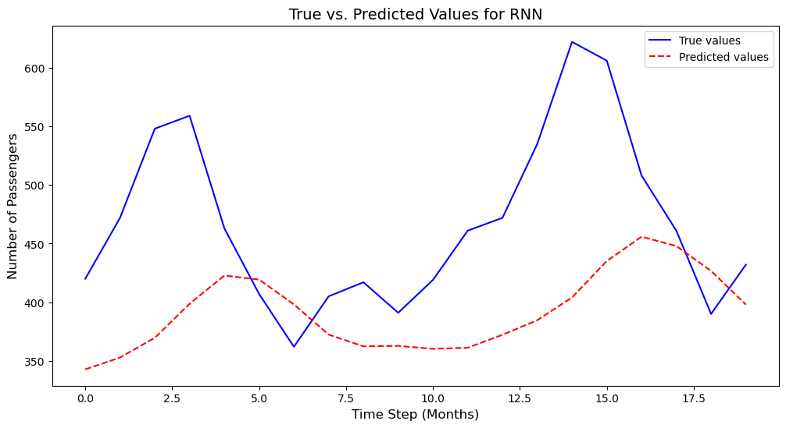
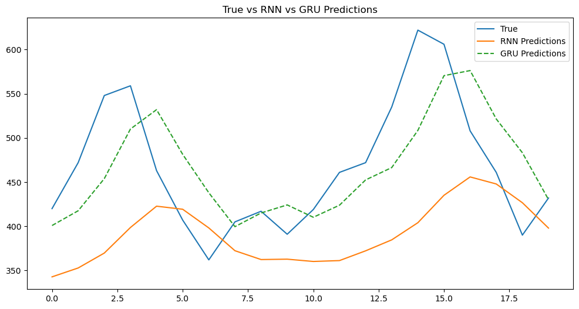

# Time Series Forecasting with RNNs and GRUs

## About data: *airline_passengers.csv*
```
Dataset Columns: Index(['Month', 'Passengers'], dtype='object')
Dataset Data Types: Month          object
Passengers    float64
dtype: object
Dataset Shape: (174, 2)
```

## Preprocess
- Load the Dataset
- Remove Duplicates
- Handle Missing Values
- Train/Val/Test split
- Normalize features
- Apply sliding windows to create (X, y) sequences
- Convert Data to PyTorch Tensors and Create DataLoaders

## Define RNN Model
A Recurrent Neural Network (RNN) for time series regression.
This model predicts a single future value based on a sequence of past values. 

## Train the RNN Model
We adjust the hyperparameters (e.g., learning rate, hidden size, number of epochs) to minimize the RMSE of the RNN model.

## Model Evaluation

<p align="center">
    
</p>

## Compare the RNN with GRU

In this section, we will compare the performance of the RNN model with the GRU (Gated Recurrent Unit) model on the same dataset. We will evaluate both models using the Root Mean Squared Error (RMSE) and visualize the results.
<p align="center">
    
</p>

```
RNN RMSE: 103.37
GRU RMSE: 58.93
```
The GRU reduces RMSE by ~44%, which is a substantial improvement. In regression problems like this, a lower RMSE directly translates to more accurate predictions on average — so GRU is much better at capturing temporal patterns in our data.
